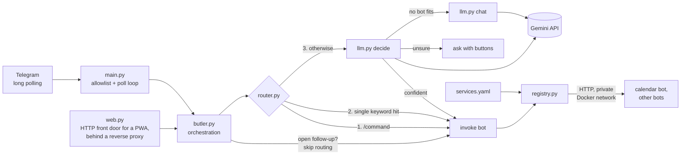

# Butler — an LLM message router for Telegram bots

One Telegram chat in front of several single-purpose bots. Butler decides which bot a message is for, cheapest first: an explicit command, then a keyword match, then an LLM routing call. If the LLM isn't sure, Butler **asks with buttons instead of guessing**.

**Personal project.** Runs on my home NAS in Docker, routing to three bots from the same project: a calendar bot ([separate repo](https://github.com/NasrumSeron/telegram-icloud-calendar-bot)) and two private ones not included here.

---

## Architecture



**Bots plug in without Butler code changes.** Each bot implements three HTTP endpoints ([CONTRACT.md](CONTRACT.md)):

- `GET /health`
- `GET /capabilities` — a plain-English description, keywords, and actions with parameter descriptions.
- `POST /invoke`

At startup Butler reads `services.yaml`, calls each bot's `/capabilities` and builds the routing catalogue from the answers. Adding a bot means adding it to `services.yaml` and rebuilding; no Butler source file is edited.

**Multi-turn without Butler knowing the domain.** A bot can return a `followup` in its reply. Butler then sends the user's *next* message straight to that bot, with no routing and no LLM call, and maps the bot's buttons to Telegram inline buttons.

- This is how "make it 2pm" reaches the calendar bot's open draft.
- The lock always releases on `ok:false`, on expiry, on `/cancel`, or on any other command.

## How the LLM is used

Two calls, both in `llm.py` (Gemini `gemini-3.5-flash-lite`):

**1. Routing (`decide`), only when commands and keywords don't settle it.**

- **Prompt:** the live bot catalogue (name, description, typical words, public actions and their params) plus the message.
- **Output:** the model must return JSON: `service`, `action`, `params`, `confidence`, and a runner-up `alternative` with its own `alternative_confidence`.
  - The runner-up must be scored independently of the top choice. That is what makes ambiguity measurable.
- **Settings:** `temperature=0`, `response_mime_type="application/json"`, 400 max output tokens.
- **Parsing is defensive:**
  - Markdown fences are stripped.
  - An unknown bot name falls back to small talk.
  - If the model picks an internal (follow-up-only) action, it is replaced with the bot's public one.
  - Parameters the action never declared are dropped; declared parameters the model left out are filled with the original message.
- **Ask, don't guess.** Butler shows "which bot did you mean?" buttons when either:
  - top confidence < 0.65, or
  - top − runner-up < 0.25.

  The margin rule exists because of a real case: "remind me about the CPF contribution deadline" went to calendar at 0.80. No absolute threshold could catch that without making Butler ask about everything.
- **Time guard:** a keyword hit plus a time phrase ("turn on my PC *at 8am tomorrow*") skips the keyword shortcut and goes to the LLM. The prompt also tells the model not to route timed requests to bots that act immediately.

**2. Small talk (`chat`), when no bot fits.**

- **Prompt:** a short persona, the list of connected bots (so "what can you do?" is answered from facts), and the last 6 turns.
- **Settings:** `temperature=0.4`.

**What the LLM never does:**

- It never sits between a bot and the screen. A bot's `reply` is shown verbatim.
- It has no tools, no shell and no file access.
- Every bot input is treated as data.

Cost is visible: `/status` shows routing calls, chat calls and how many messages the free keyword path handled.

## How it's tested

| Suite | What it proves | Result |
|---|---|---|
| `tests/test_router_offline.py` | Routing guarantees with a fake LLM: command/keyword/LLM order, thresholds and margin, time guard (incl. no false matches), param cleaning, internal-action handling, follow-up locks and release, allowlist, error handling | **101 checks** |
| `tests/test_integration_stubs.py` | The full stack over real HTTP against stub bots (`stubs/stub_service.py`), incl. a bot going down | **19 checks** |
| `tests/test_web.py` | The HTTP front door (`unittest`) | **18 tests** |
| `tests/test_calendar_integration.py` | Butler ↔ the real calendar adapter in a subprocess, Gemini and iCloud faked | **40 checks** (runs if the calendar repo is cloned alongside) |
| `tests/live/run_goldset_live.py` | Routing accuracy against the real model on a labelled set | see below |

```bash
pip install -r requirements.txt
python run_tests.py      # no keys, no network
```

### Labelled routing set (goldset)

`tests/goldset.py` holds 22 hand-written messages, each labelled with the acceptable outcome:

- a specific bot;
- "no bot, Butler answers" (4 of these are money questions, checking Butler doesn't invent a finance bot);
- or a set of acceptable outcomes.

The runner scores each row OK / MEH (asked when it could have acted) / BAD / ERR (LLM call failed, so a quota error can't pass as "chat"). It paces calls to stay under the free-tier 15 requests/minute.

**Result (29 Sep 2026, run against my live bots with `gemini-3.5-flash-lite`): 22/22 OK, 0 borderline, 0 wrong, 0 errors.** 7 rows were settled by the free keyword path; the other 15 needed an LLM call.

Caveats, stated plainly:

- **The set is small and hand-written, not sampled from real traffic.**
- It currently has **no "must ask" row**; the clarify path is covered only by the offline tests.
- The `pc` and `islam` rows need those two private bots, so the published score isn't reproducible from this repo alone.

## Run it (Docker)

```bash
cp .env.example .env    # BUTLER_TELEGRAM_TOKEN, GEMINI_API_KEY, BUTLER_ALLOWED_USER_IDS,
                        # and BUTLER_SERVICES_FILE=services.docker.yaml
docker network create --opt com.docker.network.driver.mtu=1460 bots-shared   # once, shared with the bots
docker compose up -d --build
docker compose logs -f butler
```

- `python doctor.py` checks the setup and names the fix for each problem. It never calls Telegram or Gemini.
- **Try it on a laptop without real bots:**
  1. Run `python stubs/stub_service.py calendar 9101` in one terminal.
  2. Run `python main.py` in another, using the default `services.yaml`.
- `services.docker.yaml` is copied into the image, so after editing it rebuild (`--build`); a restart isn't enough.

## Known limitations

- **In-memory state.** Conversation history, pending questions and follow-up locks are lost on restart.
- **Bot discovery.** A bot that was down at startup stays marked offline until the next re-discovery. That happens at most every 300 s, and only when a message arrives. On my NAS, after a reboot, Butler started one second before the calendar bot and marked it offline until Butler was restarted.
- **The web front door has no auth of its own.** It listens only on the private Docker network and relies on a reverse proxy with access control (Cloudflare Access in my deployment). It always acts as the first allowed user.
- **Single-owner design.** The Telegram allowlist is the only authentication. Everything goes through one global lock.
- **Confidence scores are self-reported by the LLM, not calibrated.** The thresholds were tuned by hand on the goldset.
- **Keyword matching is simple** whole-word matching on the keywords each bot declares.
- **Depends on the Gemini free tier:** 15 requests/minute, and latency varies.

## How it was built

I specified what the bot should do and made the design decisions described here: the confirmation rules, the routing thresholds, and what counts as a correct result. I also deployed and operated it on my own hardware and found the bugs mentioned in the code comments through daily use. Most of the code was written by Claude (Anthropic) from my specs, in an AI-assisted workflow.

## Licence

MIT — see [LICENSE](LICENSE).
